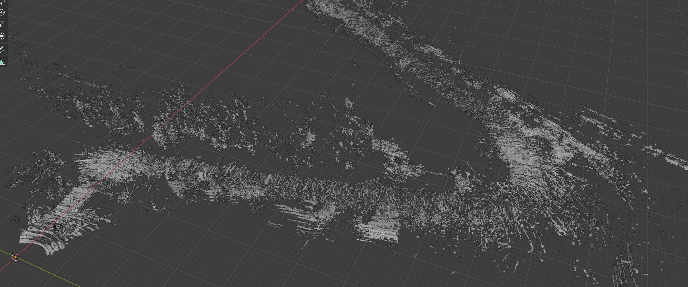

# Traffic Scene Segmentation and Reconstruction with Deep Learinng

This is the code used for my bachelor's thesis: 'Traffic Scene Segmentation and Reconstruction with Deep Learning'. It uses a modified version of [Yassouali's Pytorch Segmentation Framework](https://github.com/yassouali/pytorch-segmentation), so make sure to check it out if you're interested.

It was used to reconstruct the first recording from [The USyd Campus Dataset](http://its.acfr.usyd.edu.au/datasets/usyd-campus-dataset/), using it's lidar, video and odometry data. You can see the results in [this video](https://youtu.be/icPDHRHQwDM).

## Deployment
You can play around with this at home. We recommend having an Nvidia GPU for faster inference. This was done on a GTX 1060) but we recommend a high end graphics card if you wanted to train your own segmentation model (not necessary, since we provide one).

1. Follow the instructions at the [dataset tools repository](https://gitlab.acfr.usyd.edu.au/its/dataset_metapackage) to get the lidar_camera_projection node working.
2. [ Download Week 1](https://ieee-dataport.org/open-access/usyd-campus-dataset#) of the USyd Campus Dataset.
3. Clone this repository in your catkin workspace.
4. Run the lidar_camera_projection node from the dataset_metapackage.
5. Run our point_cloud_listener node (```rosrun tfg point_cloud_listener.py```).
6. Optionally, you can preview the generated cloud with rviz by subscribing to the topic ```final_cloud_publisher``` by using the frame of reference ```gmsl_centre_link```
7. Once you close (```ctrl+c```) the point_cloud_listener node, it will generate a file named ```cloud_color.ply``` file with your combined point cloud.
8. Use the provided script ```cloud2mesh.py``` to convert your point cloud into a polygonal mesh. You will have to provide it with the input file name, and the output will be your input + '.obj'. We recommend not reconstructing sections that took more than 5 minutes to record, since this last step is extremely slow. If you wanted to reconstruct a larger portion, you could make it by small chunks and then combine them in Blender. The result will have to be rotated ```-90º``` in the X axis and will look something like this

